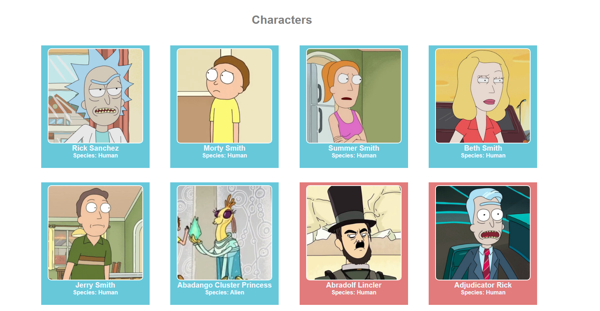

<h2 style="text-align: center">Buscando Personagens</h2>
<h3 style="text-align: center">Na API do Rick and Morty</h3>

Esta simples aplicação
lista os personagens do Rick and Morty assim que a página for montada.

Os personagens que estão vivos (Alive) serão renderizados em cards de uma cor (
turquesa) e os demais em outra (vermelha).

 É possível navegar entres as páginas que contem todos os personagens listados na API.

<a href="https://rickandmortyapi.com/">API Rick & Morty</a>    
<a href="https://react-api-rick-and-morty-beatrizmunhozl.vercel.app/">Aplicação no Vercel</a>    
 

